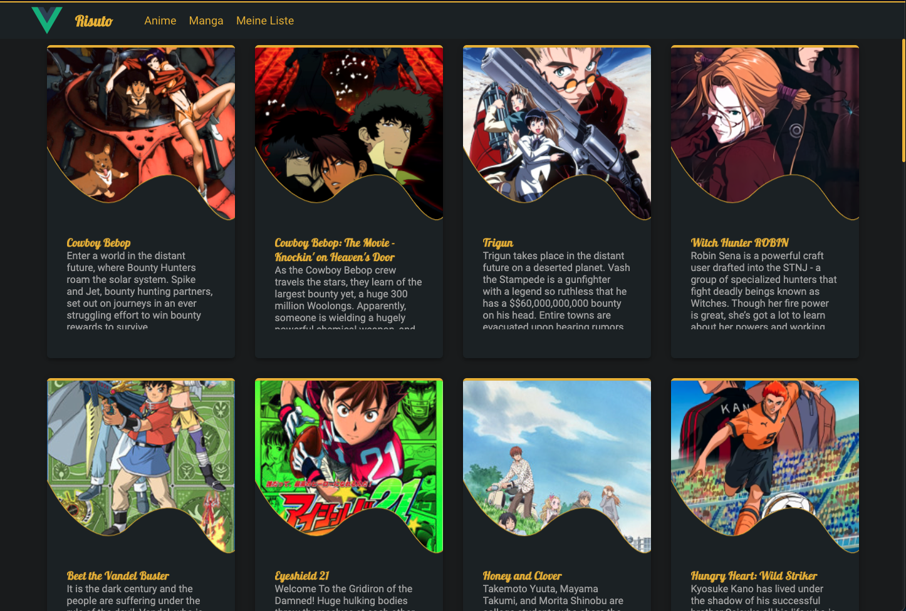
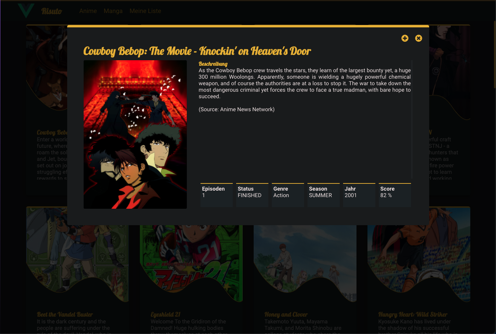

# Risuto

Bachelor Fachseminar: Web-Architekturen
Philipp Dippel
WS 19/20

Eine responsive Vue.JS Webanwendung zur Auflistung von Anime und Manga und der Verwaltung einer persönlichen ''Watchliste'' mit (Quell-)Datenanbindung an [AniList](https://anilist.co/) mittels GraphQL.





## Project setup
```
npm install
```

### Compiles and hot-reloads for development
```
npm run serve
```

### Compiles and minifies for production
```
npm run build
```
